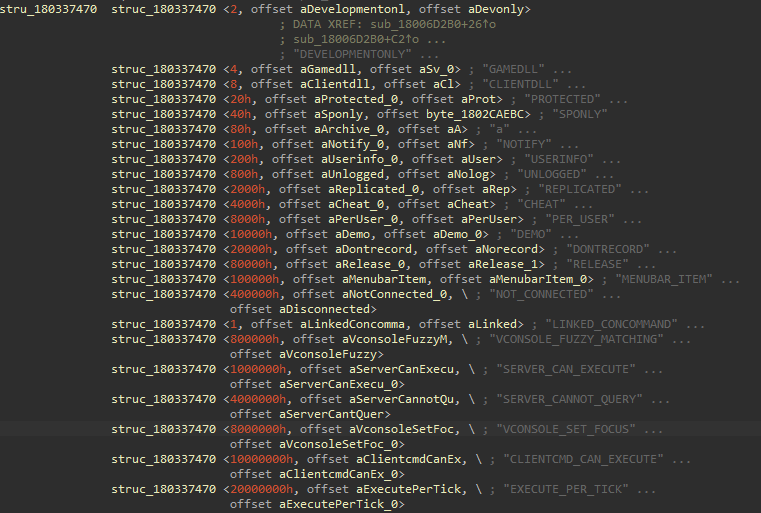
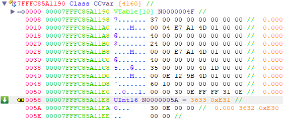
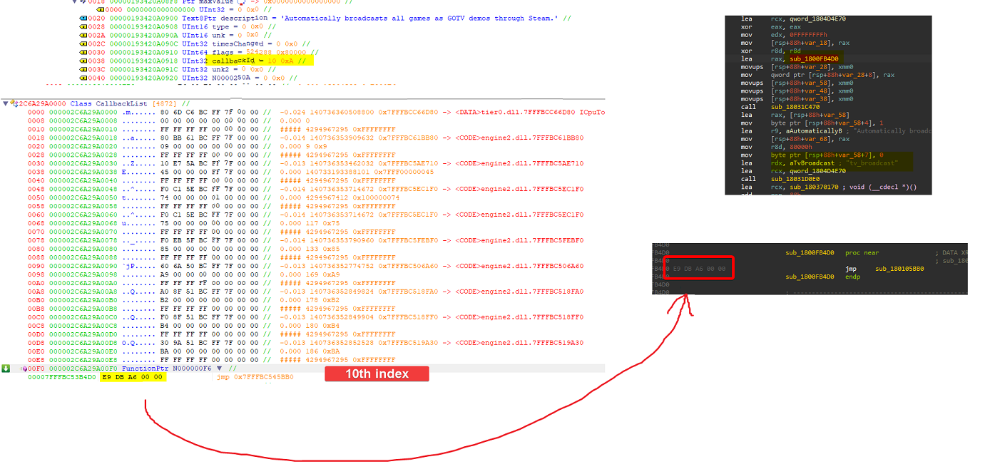

# ConVars

:::info
Flag definitons can be found in **tier0** by searching for xrefs to any of the flag names (e.g. `DEVELOPMENTONLY`)
:::

:::caution
Code that translates flags to a human readable format reads the structs from the middle, thus the flags are read by going backwards


:::

## List of ConVars

An array of pointers is located in the CCvar interface on offset 0x40


The size of the array is a 16bit number also located in the CCvar interface on offset 0x58



If we iterate through the array and dereference the pointers, we can get all the registered convars in the game.

## ConVar structure

Thanks to SlidyBat for the proper ConVar structure.

```cpp
class ConVar
{
public:
	const char *name; //0x0000
	ConVarValue_t *defaultValue; //0x0008
	ConVarValue_t *minValue; //0x0010
	ConVarValue_t *maxValue; //0x0018
	const char *description; //0x0020
	ConVarType_t type; //0x0028
	uint16_t padding; //0x002A
	uint32_t timesChanged; //0x002C
	ConVarFlags_t flags; //0x0030
	uint32_t callbackId; //0x0038
	uint32_t unk; //0x003C
	ConVarValue_t value[]; //0x0040
}; //Size: 0x0044
```


`callbackId` is the index of the callback that gets looked up in another linked list.

`type` indicates the type of the value.
Current known types are:

- 0: `boolean`
- 7: `float`
- TODO

In most cases there's only one value, but if the flag is `FCVAR_PER_USER` it will be equal to `g_pCVar->GetMaxSplitScreenSlots()`.

## ConVar callbacks

Rather than convars storing a pointer to their callback function, they store an ID that gets looked up in a list of callbacks.

CCvar+0x80 is a pointer to a list of ConVar callbacks. Every callback pointer will be `24 * callbackId` bytes away from the start of the list.

Every convar will store its callback ID in the `callbackId` field. See above.

